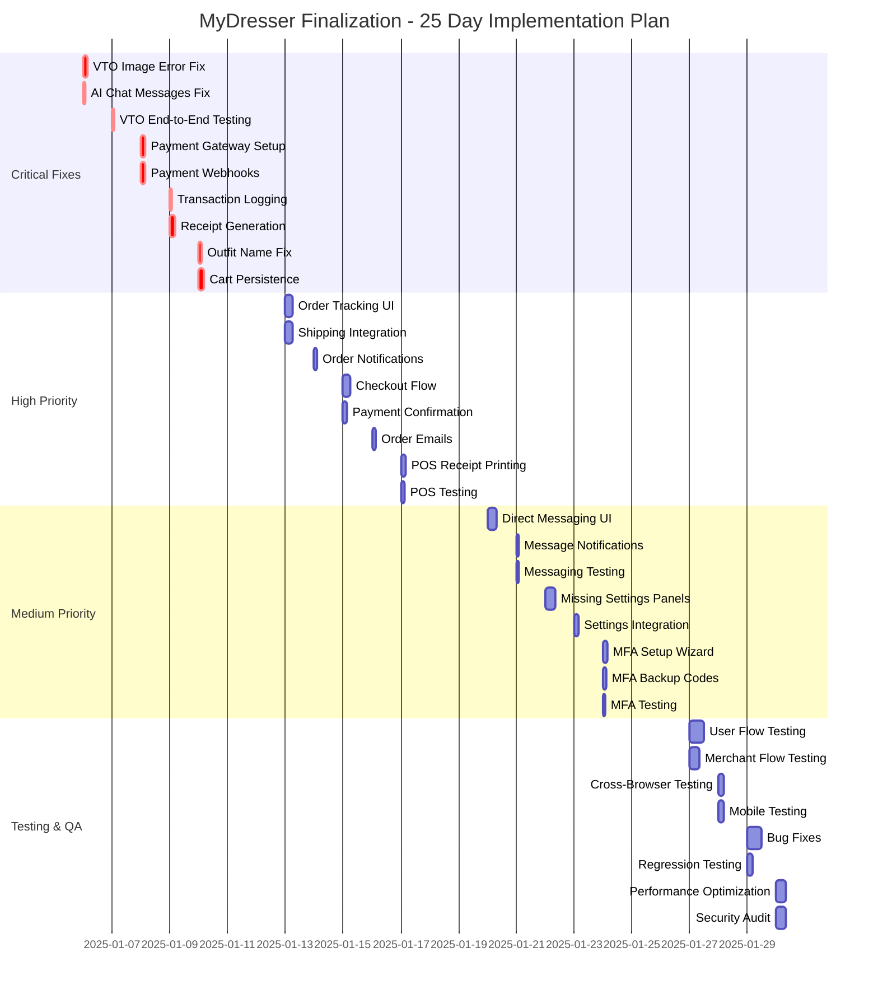
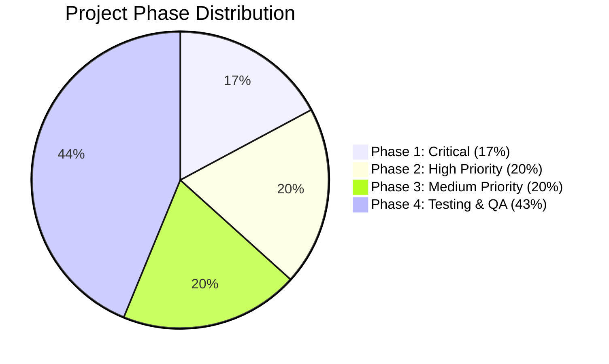

# MyDresser Implementation Gantt Chart & Progress Tracker

## 📅 Project Timeline: 25 Days (January 6 - January 30, 2025)

### Gantt Chart Visualization

---

## 📊 Task Progress Dashboard

### Phase 1: Critical Fixes (Days 1-5)

| Task ID | Task Name | Status | Assigned | Hours | Completion | Notes |
|---------|-----------|--------|----------|-------|------------|-------|
| P1-001 | Fix VTO image extraction error | 🔵 NOT STARTED | - | 4h | 0% | AI Gateway 400 error |
| P1-002 | Fix AI chat messages iteration | 🔵 NOT STARTED | - | 2h | 0% | Edge function error |
| P1-003 | VTO end-to-end testing | 🔵 NOT STARTED | - | 2h | 0% | Post-fix verification |
| P1-004 | Stripe payment gateway setup | 🔵 NOT STARTED | - | 4h | 0% | Environment config |
| P1-005 | Payment webhook handlers | 🔵 NOT STARTED | - | 4h | 0% | Edge function |
| P1-006 | Transaction logging system | 🔵 NOT STARTED | - | 2h | 0% | Database + logs |
| P1-007 | Receipt generation | 🔵 NOT STARTED | - | 4h | 0% | PDF/print format |
| P1-008 | Outfit name regeneration fix | 🔵 NOT STARTED | - | 3h | 0% | DailyOutfitWithVTO |
| P1-009 | Cart persistence implementation | 🔵 NOT STARTED | - | 4h | 0% | DB + state management |

**Phase 1 Total**: 29 hours  
**Phase 1 Completion**: 0%

---

### Phase 2: High-Priority Features (Days 6-10)

| Task ID | Task Name | Status | Assigned | Hours | Completion | Notes |
|---------|-----------|--------|----------|-------|------------|-------|
| P2-001 | Order tracking UI component | 🔵 NOT STARTED | - | 6h | 0% | Timeline view |
| P2-002 | Shipping integration API | 🔵 NOT STARTED | - | 6h | 0% | Label generation |
| P2-003 | Order status notifications | 🔵 NOT STARTED | - | 2h | 0% | Real-time updates |
| P2-004 | Complete checkout flow | 🔵 NOT STARTED | - | 6h | 0% | Multi-step wizard |
| P2-005 | Payment confirmation screens | 🔵 NOT STARTED | - | 3h | 0% | Success/failure |
| P2-006 | Order confirmation emails | 🔵 NOT STARTED | - | 3h | 0% | Email templates |
| P2-007 | POS receipt printing | 🔵 NOT STARTED | - | 4h | 0% | Thermal printer |
| P2-008 | POS end-to-end testing | 🔵 NOT STARTED | - | 3h | 0% | Hardware test |

**Phase 2 Total**: 33 hours  
**Phase 2 Completion**: 0%

---

### Phase 3: Medium-Priority Features (Days 11-15)

| Task ID | Task Name | Status | Assigned | Hours | Completion | Notes |
|---------|-----------|--------|----------|-------|------------|-------|
| P3-001 | Direct messaging UI | 🔵 NOT STARTED | - | 8h | 0% | Chat interface |
| P3-002 | Message notifications | 🔵 NOT STARTED | - | 2h | 0% | Real-time alerts |
| P3-003 | Messaging flow testing | 🔵 NOT STARTED | - | 2h | 0% | E2E test |
| P3-004 | Missing settings panels | 🔵 NOT STARTED | - | 8h | 0% | 5+ panels |
| P3-005 | Settings integration | 🔵 NOT STARTED | - | 4h | 0% | Feature hookup |
| P3-006 | MFA setup wizard | 🔵 NOT STARTED | - | 4h | 0% | Multi-step flow |
| P3-007 | MFA backup codes UI | 🔵 NOT STARTED | - | 3h | 0% | Download/display |
| P3-008 | MFA flow testing | 🔵 NOT STARTED | - | 2h | 0% | All auth types |

**Phase 3 Total**: 33 hours  
**Phase 3 Completion**: 0%

---

### Phase 4: Testing & QA (Days 16-25)

| Task ID | Task Name | Status | Assigned | Hours | Completion | Notes |
|---------|-----------|--------|----------|-------|------------|-------|
| P4-001 | User flow testing | 🔵 NOT STARTED | - | 12h | 0% | All 58 pages |
| P4-002 | Merchant flow testing | 🔵 NOT STARTED | - | 8h | 0% | Terminal features |
| P4-003 | Cross-browser testing | 🔵 NOT STARTED | - | 4h | 0% | Chrome, Firefox, Safari |
| P4-004 | Mobile device testing | 🔵 NOT STARTED | - | 4h | 0% | iOS, Android |
| P4-005 | Bug fixes (identified issues) | 🔵 NOT STARTED | - | 12h | 0% | From testing |
| P4-006 | Regression testing | 🔵 NOT STARTED | - | 4h | 0% | Re-test fixes |
| P4-007 | Slow query optimization | 🔵 NOT STARTED | - | 3h | 0% | Database perf |
| P4-008 | Caching implementation | 🔵 NOT STARTED | - | 3h | 0% | React Query |
| P4-009 | Bundle size optimization | 🔵 NOT STARTED | - | 2h | 0% | Code splitting |
| P4-010 | Security vulnerability scan | 🔵 NOT STARTED | - | 2h | 0% | Automated tools |
| P4-011 | RLS policy review | 🔵 NOT STARTED | - | 2h | 0% | Manual audit |
| P4-012 | Auth flow testing | 🔵 NOT STARTED | - | 2h | 0% | All scenarios |
| P4-013 | Security issue fixes | 🔵 NOT STARTED | - | 4h | 0% | Critical items |
| P4-014 | API documentation | 🔵 NOT STARTED | - | 4h | 0% | OpenAPI spec |
| P4-015 | User guides | 🔵 NOT STARTED | - | 4h | 0% | Screenshots |
| P4-016 | Merchant documentation | 🔵 NOT STARTED | - | 4h | 0% | Terminal guide |
| P4-017 | Feature checklist review | 🔵 NOT STARTED | - | 3h | 0% | 120 features |
| P4-018 | Stakeholder review meeting | 🔵 NOT STARTED | - | 3h | 0% | Demo + feedback |
| P4-019 | Launch preparation | 🔵 NOT STARTED | - | 2h | 0% | Final checks |

**Phase 4 Total**: 74 hours  
**Phase 4 Completion**: 0%

---

## 📈 Overall Progress

### Summary Statistics

| Metric | Value |
|--------|-------|
| **Total Tasks** | 44 |
| **Total Hours** | 169h |
| **Completed Tasks** | 0 |
| **In Progress** | 0 |
| **Not Started** | 44 |
| **Blocked** | 0 |
| **Overall Completion** | 0% |

### Phase Progress

### Progress by Category

| Category | Tasks | Completed | Progress |
|----------|-------|-----------|----------|
| **VTO Fixes** | 3 | 0 | 0% |
| **Payment Integration** | 4 | 0 | 0% |
| **Cart & Orders** | 5 | 0 | 0% |
| **Messaging** | 3 | 0 | 0% |
| **Settings** | 2 | 0 | 0% |
| **Security (MFA)** | 3 | 0 | 0% |
| **Testing** | 12 | 0 | 0% |
| **Optimization** | 4 | 0 | 0% |
| **Documentation** | 5 | 0 | 0% |
| **Launch Prep** | 3 | 0 | 0% |

---

## 🎯 Daily Task Assignments

### Week 1: Critical Fixes

#### Monday, Jan 6
- [ ] P1-001: Fix VTO image extraction (4h)
- [ ] P1-002: Fix AI chat messages (2h)

#### Tuesday, Jan 7
- [ ] P1-003: VTO testing (2h)
- [ ] P1-004: Payment gateway setup (4h)

#### Wednesday, Jan 8
- [ ] P1-005: Payment webhooks (4h)
- [ ] P1-006: Transaction logging (2h)

#### Thursday, Jan 9
- [ ] P1-007: Receipt generation (4h)
- [ ] P1-008: Outfit name fix (3h)

#### Friday, Jan 10
- [ ] P1-009: Cart persistence (4h)

### Week 2: High-Priority Features

#### Monday, Jan 13
- [ ] P2-001: Order tracking UI (6h)
- [ ] P2-002: Shipping integration (6h)

#### Tuesday, Jan 14
- [ ] P2-003: Order notifications (2h)
- [ ] P2-004: Checkout flow (6h)

#### Wednesday, Jan 15
- [ ] P2-005: Payment confirmation (3h)
- [ ] P2-006: Order emails (3h)

#### Thursday, Jan 16
- [ ] P2-007: POS receipt printing (4h)

#### Friday, Jan 17
- [ ] P2-008: POS testing (3h)

### Week 3: Medium-Priority Features

#### Monday, Jan 20
- [ ] P3-001: Direct messaging UI (8h)

#### Tuesday, Jan 21
- [ ] P3-002: Message notifications (2h)
- [ ] P3-003: Messaging testing (2h)
- [ ] P3-004: Settings panels start (4h)

#### Wednesday, Jan 22
- [ ] P3-004: Settings panels continue (4h)
- [ ] P3-005: Settings integration (4h)

#### Thursday, Jan 23
- [ ] P3-006: MFA wizard (4h)
- [ ] P3-007: MFA backup codes (3h)

#### Friday, Jan 24
- [ ] P3-008: MFA testing (2h)

### Week 4: Testing & QA

#### Monday, Jan 27
- [ ] P4-001: User flow testing (12h - split over 2 days)

#### Tuesday, Jan 28
- [ ] P4-001: User flow testing (continued)
- [ ] P4-002: Merchant testing (8h - split)

#### Wednesday, Jan 29
- [ ] P4-002: Merchant testing (continued)
- [ ] P4-003: Cross-browser (4h)
- [ ] P4-004: Mobile testing (4h)

#### Thursday, Jan 30
- [ ] P4-005: Bug fixes (12h - split)
- [ ] P4-006: Regression testing (4h)

#### Friday, Jan 31
- [ ] P4-007-009: Performance optimization (8h)
- [ ] P4-010-013: Security audit & fixes (10h)

---

## 🔔 Milestone Tracking

| Milestone | Target Date | Status | Completion Criteria |
|-----------|-------------|--------|---------------------|
| **M1: Critical Issues Resolved** | Jan 10 | 🔵 NOT STARTED | VTO working, AI chat fixed, payments functional |
| **M2: Marketplace Complete** | Jan 17 | 🔵 NOT STARTED | End-to-end transactions working |
| **M3: Feature Parity** | Jan 24 | 🔵 NOT STARTED | All features functional with settings |
| **M4: QA Complete** | Jan 30 | 🔵 NOT STARTED | All tests passed, docs complete |
| **M5: Production Ready** | Jan 31 | 🔵 NOT STARTED | Launch approval obtained |

---

## 📝 Change Log

| Date | Change | Impact | Updated By |
|------|--------|--------|------------|
| 2025-01-04 | Initial plan created | Project baseline established | AI Assistant |
| - | - | - | - |

---

## 🚀 Next Actions

1. **Review this plan** with stakeholders
2. **Assign tasks** to team members (if applicable)
3. **Begin Phase 1** - Fix VTO error
4. **Update progress daily** in this document
5. **Hold weekly reviews** at end of each phase

---

**Last Updated**: January 4, 2025  
**Next Review**: January 10, 2025 (End of Phase 1)
